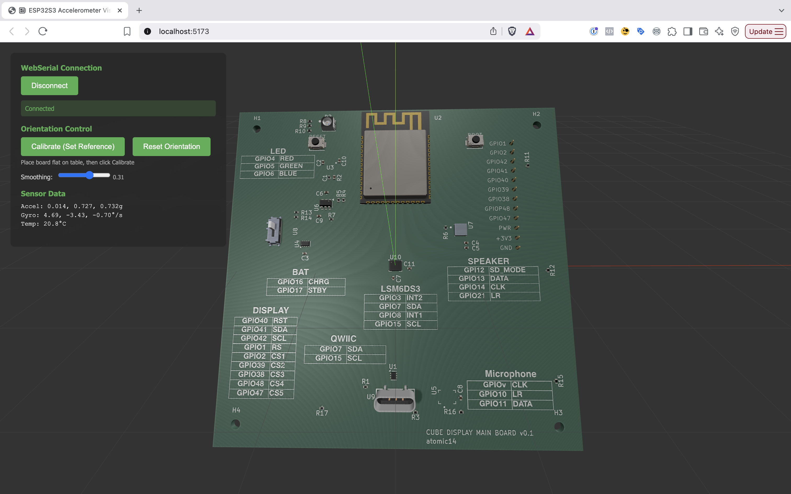

[](https://github.com/atomic14/ESP32-LSM6DS3-Demo/actions/workflows/firmware.yml)
[](https://github.com/atomic14/ESP32-LSM6DS3-Demo/actions/workflows/frontend.yml)

# ESP32S3 IMU (Accelerometer + Gyroscope) Demo

A complete hardware + software solution for real-time 3D IMU visualization. This project combines an ESP32S3 microcontroller with the LSM6DS3 accelerometer/gyroscope and a web-based 3D visualization frontend.



Demo site: https://lsm6ds3.atomic14.com/

## Overview

- **Hardware**: ESP32S3 + LSM6DS3 accelerometer with I2C communication
- **Firmware**: Clean JSON data output over serial (115200 baud)
- **Frontend**: Three.js web application with WebSerial API integration
- **Visualization**: Real-time 3D PCB orientation tracking with GLB model support

## Project Structure

```
├── firmware/           # ESP32S3 Arduino firmware
│   ├── src/main.cpp   # Main firmware code
│   └── platformio.ini # PlatformIO configuration
├── frontend/          # Three.js web application
│   ├── src/           # TypeScript source code
│   ├── public/        # Static assets served by Vite
│   │   └── pcb.glb    # 3D PCB model file
│   └── package.json   # Dependencies and scripts
├── CLAUDE.md          # Development guidance
└── README.md          # This file
```

## Quick Start

### 1. Hardware Setup
- **Board**: ESP32-S3-DevKitC-1
- **Sensor**: LSM6DS3 accelerometer/gyroscope
- **Wiring**: 
  - SDA → GPIO7
  - SCL → GPIO15  
  - VCC → 3.3V
  - GND → GND

### 2. Firmware Upload
```bash
cd firmware
pio run --target upload
pio device monitor  # Monitor serial output
```

### 3. Frontend Development
```bash
cd frontend
npm install
npm run dev         # Start development server
```

### 4. Connect & Visualize
1. Open `http://localhost:5173` in Chrome/Edge
2. Click "Connect to ESP32S3"
3. Select ESP32S3 serial port
4. Choose an orientation mode:
   - `Accelerometer (abs)`: absolute tilt (pitch/roll) with optional smoothing
   - `Gyro (integrated)`: integrates angular rate to track orientation
   - `Fusion (AHRS)`: uses accelerometer and gyroscope data to estimate orientation
5. Use the `Reset` button to zero gyro integration if needed
6. Tilt/rotate the PCB to see real-time 3D visualization

## Features

### Hardware
- **I2C Communication**: LSM6DS3 at address 0x6B
- **10Hz Data Rate**: Smooth real-time updates
- **JSON Output**: Clean, parseable data format
- **Auto-detection**: I2C device scanning and sensor initialization

### Frontend
- **WebSerial Integration**: Direct browser-to-device communication
- **3D PCB Model**: GLB file support with automatic scaling
- **Orientation Modes**: Accelerometer (absolute tilt) or Gyro (integrated)
- **Adjustable Smoothing (Accel only)**: Fine-tune responsiveness vs stability
- **Dual Charts**: Live accelerometer and gyroscope charts with titles and right-aligned legends
- **Professional Lighting**: Specular reflections and realistic materials
- **Mouse Controls**: Orbit camera, zoom, and inspect the model

## Data Format

The firmware outputs JSON at 10Hz (example):
```jsonc
{
  // Accelerometer data in g
  "accel": { "x": 0.123, "y": 0.456, "z": 0.789 },
  // Gyroscope data in deg/s
  "gyro": { "x": 1.23, "y": 4.56, "z": 7.89 },
  // Euler angles in degrees (from Fusion AHRS)
  "euler": { "roll": 10.0, "pitch": 20.0, "yaw": 30.0 },
  // Temperature in °C
  "temp": 25.4
}
```

## Browser Requirements

- ✅ Chrome 89+ (WebSerial API support)
- ✅ Edge 89+ (WebSerial API support)  
- ❌ Firefox (no WebSerial support)
- ❌ Safari (no WebSerial support)

## Development Commands

### Firmware (PlatformIO)
```bash
cd firmware
pio run                    # Build firmware
pio run --target upload    # Upload to ESP32S3
pio device monitor         # Monitor serial output
pio run --target clean     # Clean build files
```

### Frontend (Node.js)
```bash
cd frontend
npm install               # Install dependencies
npm run dev              # Development server
npm run build            # Production build
npm run type-check       # TypeScript checking
npm run lint             # Code linting
```

## Troubleshooting

### Hardware Issues
- **No I2C device found**: Check wiring and power supply
- **Sensor initialization failed**: Verify LSM6DS3 address (0x6B with SDO→VCC)
- **No serial output**: Check USB cable and ESP32S3 connection

### Frontend Issues
- **Connection failed**: Ensure Chrome/Edge browser and HTTPS/localhost
- **No data received**: Verify firmware is outputting JSON format
- **Model not loading**: Check that `pcb.glb` exists in public folder

## Technical Details

- **Accelerometer Range**: ±2g, ±4g, ±8g, ±16g (configurable)
- **Gyroscope Range**: ±125°/s, ±250°/s, ±500°/s, ±1000°/s, ±2000°/s
- **I2C Speed**: 100kHz for reliable communication
- **Serial Baud Rate**: 115200 for fast data transfer
- **Update Rate**: 10Hz (100ms intervals) by default (adjustable in firmware)

## Sensor Fusion (AHRS)

- Orientation fusion is provided by the xioTechnologies Fusion AHRS library. See the repository for details: [xioTechnologies/Fusion](https://github.com/xioTechnologies/Fusion/tree/main).
- Configuration: NWU earth-frame convention; Euler angles extracted using ZYX order; magnetometer disabled in this project.

## License

This project is open source. See individual component licenses for details.